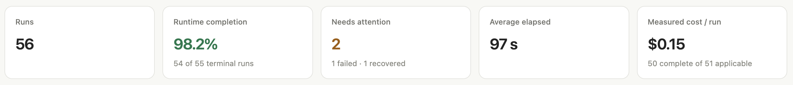
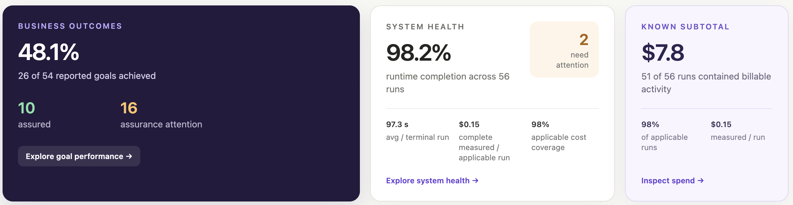
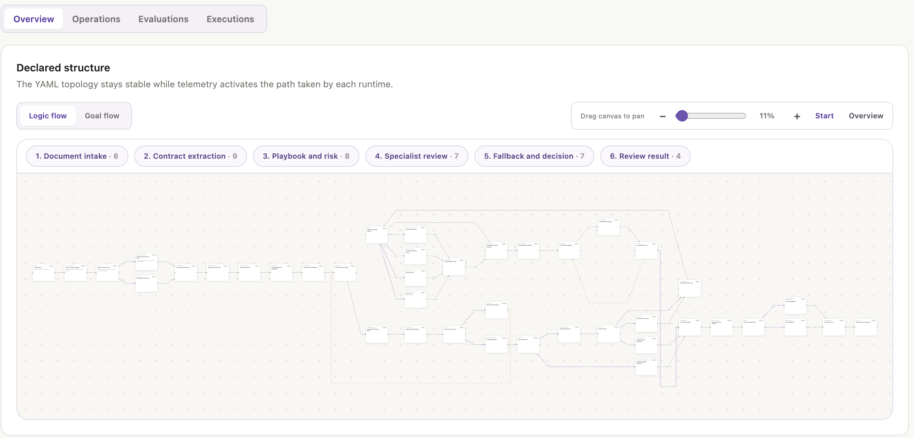
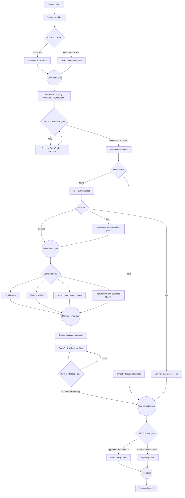

# Witdem Intelligence for Haystack CUAD Contract Review

`haystack-cuad-contract-review` is a [Witdem](https://github.com/ebrahimisoheil/witdem-oss)
intelligence-layer showcase built on a multi-model contract workflow. Witdem
connects the workflow's execution path, provider usage, latency, tokens, cost,
and failures to the contract-review outcome. Haystack owns orchestration,
LiteLLM owns model routing, and CUAD supplies optional real-world contract data.

## What it does

This reference application reviews fictional-company vendor SaaS agreements through a realistic, intelligence-enabled contract-operations workflow. It selects native PDF extraction or Mistral OCR, uses DeepSeek for text transformations, applies a fictional playbook, asks OpenAI GPT-5.4 to judge extraction quality, risk, fallback acceptability, and the final state, then returns an evidence-backed machine-readable audit and post-signature obligations.

## Architecture

~~~text
Witdem intelligence layer
  <- execution graph, retries, tokens, cost, failures, business outcome
Haystack workflow layer (41 declared components)
  -> input and quality routing
  -> extraction, review, retry loops, final decision
LiteLLM model gateway
  -> Mistral vision/OCR
  -> DeepSeek text processing
  -> OpenAI judging and final gates
~~~

The application remains framework-centric: Haystack owns orchestration and
branching, and LiteLLM owns model/provider access. Witdem sits above both as the
intelligence layer, turning their technical execution into an explainable run
with product-goal evidence. Components request a logical role rather than a
provider. Model routing is declared in
[model_routing.yaml](contract_review_agent/app/model_routing.yaml), so model
experiments do not require graph changes.

## Witdem intelligence layer

This repository is first a Witdem showcase: one heterogeneous execution becomes
a connected account of what ran, which models were involved, what they cost,
where retries occurred, and whether the application achieved its declared
business goal. The committed [Witdem contract](.witdem/witdem.yaml) gives the
technical trace application meaning without hard-coding analytics into the
Haystack components.

The strongest live demo uses a raster-only PDF so one execution visibly crosses
Mistral, DeepSeek, and OpenAI while Witdem preserves the complete Haystack path:

~~~text
Witdem execution intelligence and business outcome
  <- Haystack input, quality routing, branches, and retries
       <- Mistral OCR through LiteLLM
       <- DeepSeek extraction and normalization through LiteLLMChatGenerator
       <- GPT-5.4 quality, risk, and final gates through LiteLLMChatGenerator
~~~

### What Witdem produced

These views were produced by Witdem from the live Haystack and LiteLLM
telemetry generated by this repository. They are not hand-drawn architecture
diagrams or custom dashboard code in the example application.

**1. Population-level operating summary.** Witdem reports runtime completion,
runs needing attention, elapsed time, and measured cost per run across the
current system population. The values shown here come from the 56-run live demo
population and will change as new executions are recorded.

**2. Business outcomes and system health.** The YAML contracts let Witdem keep
technical completion, product-goal achievement, assurance, and cost coverage
separate. A workflow can therefore complete successfully while its evidence or
evaluation results still require attention.

**3. Declared workflow structure.** The complete topology comes from
[`contract-review.yaml`](.witdem/workflows/contract-review.yaml). Witdem keeps
the six phases and 41 Haystack components stable, then projects each observed
execution onto that declaration. The graph exposes native-versus-OCR routing,
playbook decisions, specialist fan-out and convergence, fallback retries, and
the final result branches.

Together, the views show why Witdem is the intelligence layer in this
repository: it connects the declared YAML workflow and business contracts to
what actually ran, what it cost, and whether the application achieved its
intended outcome.

### Tutorial: the Witdem YAML contract

The committed [`.witdem/witdem.yaml`](.witdem/witdem.yaml) is the bridge between
technical telemetry and the business analysis above. The
[project-specific tutorial](docs/witdem-contract-tutorial.md) explains every
section and the reasoning behind it, including why a manual-review disposition
can still achieve the product goal, why quality evaluations and diagnostic
metrics are separate, and why contract content capture is off by default.

After the public Witdem services are running and `.env` contains the three
provider keys, create a safe fictional scan and run the verifier:

~~~bash
npx -y witdem@stable-0-1 up
uv run --extra dev python examples/create_showcase_scan.py
uv run contract-review-showcase output/showcase/scanned-vendor-saas.pdf
~~~

The command exits unsuccessfully unless Witdem exposes the new Haystack run and
attributes DeepSeek, Mistral, OpenAI, model calls, tokens, and measured cost. It
prints a direct dashboard URL for the execution graph. The contract's approval
result is intentionally not a pass/fail condition—the integration evidence is.

## Haystack workflow

This repository is designed to make the Haystack execution model visible, not
to hide the workflow behind one agent call. The graph contains typed business
components, `ConditionalRouter` branches, joiners, bounded retry loops, and one
shared role registry built on the official `litellm-haystack` integration.

The implementation targets haystack-ai 3.1.x and the maintained
litellm-haystack 1.2.x integration. It uses Haystack 3 chat generators and
avoids the legacy generators removed in Haystack 3.

## Model routing

| Task type | Logical role | LiteLLM model | Used for |
|---|---|---|---|
| PDF/image understanding | vision | mistral/mistral-ocr-latest | Scanned PDF OCR, layout-aware page extraction, page evidence |
| Text extraction/transformation | text | deepseek/deepseek-chat | Normalization, classification, metadata, clauses, terms, fallback drafting, obligations |
| Judge/evaluation/approval | judge | openai/gpt-5.4 | Extraction gate, playbook evaluation, severity, fallback gate, final decision |

All LLM and multimodal calls must go through LiteLLM unless LiteLLM cannot expose the capability. Haystack remains the orchestration layer. The official Haystack LiteLLM generator is used for chat calls; the shared role registry calls LiteLLM's OCR endpoint only because the chat generator does not expose document OCR.

Override a role without editing the graph:

~~~bash
export CONTRACT_REVIEW_TEXT_MODEL=anthropic/claude-sonnet-4-5
export CONTRACT_REVIEW_VISION_MODEL=gemini/gemini-2.5-pro
export CONTRACT_REVIEW_JUDGE_MODEL=openai/gpt-5.4
~~~

The defaults deliberately follow the required DeepSeek/Mistral/GPT-5.4 specialization.

## Workflow and branches

[Open the exact Haystack socket-level topology](docs/images/haystack-workflow-graph.svg),
generated directly from `build_pipeline()`, to inspect every typed connection,
router output, loop, and joiner.

The four domain reviewers above are independent Haystack components, not labels
written by a single routing step. Only domains with relevant deviations perform
model work. Their decisions converge into a typed `domain_reviews` result before
fallback drafting. High-risk contracts pass through a policy gate that prevents
an LLM from approving them without human review; low-risk deviations can bypass
negotiation entirely.

Final states are approved, approved_with_exceptions, manual_review_required, rejected_by_playbook, and processing_failed.

## Fictional playbook

[vendor_saas.yaml](contract_review_agent/app/playbooks/vendor_saas.yaml) covers term and renewal, termination, liability, indemnity, governing law, assignment, data/security, SLA, and payment. It routes findings to legal, finance, security/privacy, and procurement/business-owner review. These are example business rules, not statements of law.

## Quick start

The locked `uv` workflow is the most reproducible setup:

~~~bash
cd haystack-cuad-contract-review
uv sync --locked --extra dev
cp .env.example .env
uv run --extra dev python examples/run_demo_suite.py
~~~

The application loads `.env` automatically. The default deterministic mode
does not call model providers and does not require API keys.

Witdem is installed exclusively from its public package—this project does not
use a Git dependency or require a local Witdem source checkout. The pinned SDK
includes the Haystack and LiteLLM integrations used by the showcase. Its public
source and documentation are available in
[witdem-oss](https://github.com/ebrahimisoheil/witdem-oss).

~~~bash
python -m pip install "witdem-sdk[haystack,litellm]==0.1.1"
~~~

To use a standard virtual environment instead:

~~~bash
python3 -m venv .venv
source .venv/bin/activate
python -m pip install -U pip
python -m pip install -e ".[dev]"
cp .env.example .env
python examples/run_demo_suite.py
~~~

No API keys are required for deterministic examples or tests. Live mode requires the keys for every role reached by a run.

## Environment variables

| Variable | Purpose |
|---|---|
| DEEPSEEK_API_KEY | DeepSeek credential used by LiteLLM |
| MISTRAL_API_KEY | Mistral OCR credential used by LiteLLM |
| OPENAI_API_KEY | OpenAI judge credential used by LiteLLM |
| CONTRACT_REVIEW_MODE | deterministic or live |
| CONTRACT_REVIEW_MODELS_FILE | Alternate declarative role-routing YAML |
| CONTRACT_REVIEW_*_MODEL | Optional TEXT, VISION, or JUDGE model override |
| CONTRACT_REVIEW_MAX_RETRIES | Workflow retry cap; default 2 |
| CONTRACT_REVIEW_TIMEOUT_SECONDS | Provider timeout; default 60 |
| CONTRACT_REVIEW_WITDEM_CONFIG | Optional alternate Witdem contract/configuration file |

Secrets are read from the environment and never serialized into results.

## Run examples

Run all four reproducible paths:

~~~bash
.venv/bin/python examples/run_demo_suite.py
~~~

Review one deterministic fixture-compatible document:

~~~bash
.venv/bin/python examples/run_contract.py path/to/contract.pdf
~~~

Use live providers:

~~~bash
CONTRACT_REVIEW_MODE=live .venv/bin/python -m contract_review_agent.app.main path/to/contract.pdf --mode live
~~~

Run verification:

~~~bash
uv run --extra dev pytest
~~~

## Example output

~~~json
{
  "contract_id": "6d4d34eb5f0a3a91",
  "agreement_type": "Vendor SaaS Agreement",
  "parties": {
    "customer": "Acme Example Corporation",
    "vendor": "Risky Cloud Inc."
  },
  "deviations": [
    {
      "clause": "termination",
      "severity": "medium",
      "reason": "Termination for convenience is absent.",
      "evidence": {
        "page": 1,
        "text": "Either party may terminate for cause upon 30 days notice.",
        "clause_label": "termination",
        "extraction_method": "native_pdf_text",
        "confidence": 0.94
      },
      "review_area": "legal"
    }
  ],
  "final_decision": "approved_with_exceptions",
  "review_areas": ["legal", "finance"],
  "domain_reviews": [
    {
      "area": "legal",
      "decision": "negotiate",
      "highest_risk": "medium",
      "deviation_count": 2,
      "rationale": "Two legal deviations require fallback language."
    },
    {
      "area": "finance",
      "decision": "negotiate",
      "highest_risk": "medium",
      "deviation_count": 1,
      "rationale": "Net 15 payment terms require a commercial exception."
    }
  ],
  "outcome": {
    "review_completed": true,
    "evidence_complete": true,
    "playbook_evaluated": true,
    "routing_complete": true,
    "objective_met": true
  }
}
~~~

The actual result also contains all normalized terms, clauses, fallbacks,
obligations, errors, and run metrics.

## Witdem intelligence and measurement

Every run emits total and per-stage latency, configured model per stage, LiteLLM token/cost telemetry, retries, full branch path, extraction confidence, deviation and escalation counts, unresolved fields, evidence completeness, and explicit business outcomes.

Deterministic mode reports zero model tokens and cost because it makes no provider calls. It does not present estimates as actual usage.

To inspect runs in Witdem, start the public version-matched backend package, then
run the examples:

~~~bash
npx -y witdem@stable-0-1 up
uv run --extra dev python examples/run_demo_suite.py
~~~

The default [Witdem contract](.witdem/witdem.yaml) exports to
`http://localhost:4318`; the dashboard is available at
`http://localhost:8501`. Tests use an isolated telemetry configuration, so a
test run cannot add synthetic entries to a developer's dashboard.

The complete 41-step Haystack DAG is declared in
[`.witdem/workflows/contract-review.yaml`](.witdem/workflows/contract-review.yaml).
It describes stages, branches, fan-out/convergence, and retry routes without
adding Witdem-specific orchestration to the application. The dashboard keeps
that YAML topology stable and projects each observed execution onto it.

## Test data

The deterministic suite creates a clean native-text PDF, a raster-only PDF with a page-indexed OCR sidecar that forces the Mistral role, a PDF with legal and finance deviations, and a PDF missing DPA language on the first pass.

These synthetic agreements are small and reproducible. For broader evaluation,
use the [CUAD dataset](https://github.com/TheAtticusProject/cuad), review its
current terms, and preserve original document and label provenance. Downloaded
contracts and generated subsets are deliberately excluded from this repository;
see [data attribution](DATA_ATTRIBUTION.md).

## CUAD ingestion

The CUAD ingestion layer accepts either the official SQuAD-style annotation JSON or a local full CUAD v1 release. It validates every annotated answer offset, records source hashes and attribution, materializes exact contract text, matches original PDFs when present, and produces a strict manifest that can be passed directly to the Haystack workflow.

Download the official annotation archive and create a seeded 20-contract subset:

~~~bash
.venv/bin/cuad-data ingest \
  --download \
  --cache-dir data/cuad-cache \
  --output data/cuad-subset \
  --limit 20 \
  --seed 42
~~~

Ingest a local full release and restrict it to service agreements with positive governing-law labels:

~~~bash
.venv/bin/cuad-data ingest \
  --source /path/to/CUAD_v1 \
  --output data/cuad-service-subset \
  --agreement-type "Service Agreement" \
  --require-category "Governing Law" \
  --limit 20
~~~

Run the selected contracts through the existing workflow:

~~~bash
.venv/bin/cuad-data review data/cuad-subset/manifest.json \
  --mode live \
  --output cuad-runs/cuad-review.json
~~~

The default limit is 20. Limits above 100 require the explicit `--allow-large` flag to prevent accidental high-cost batches. Deterministic mode is useful for testing ingestion, integrity, branching, and audit mechanics; it is not an accuracy benchmark for naturally drafted CUAD contracts. Use live mode for model-quality evaluation.

### CUAD ground-truth evaluation

CUAD labels stay outside the instrumented Haystack inputs. A post-run result
reporter evaluates them only after every model call, judge, route, and retry has
completed, then reports the scores to Witdem on the same execution. The labels
cannot enter prompts, change the prediction, or appear in captured pipeline
inputs. The evaluator currently maps seven categories that have an honest
correspondence with this workflow's output schema:

- Governing Law
- Termination For Convenience
- Anti-Assignment
- Cap On Liability
- Uncapped Liability
- Renewal Term
- Notice Period To Terminate Renewal

For each contract, the result includes category precision, recall, F1 and
accuracy; negative-label accuracy; evidence-span exact match; token-level span
F1; the confusion counts; and per-category outcomes. The batch summary
recomputes micro metrics from all selected contracts instead of averaging
per-contract percentages.

The [Witdem configuration](.witdem/witdem.yaml) contains a dedicated reported
contract for CUAD runs. It declares category F1, evidence-span token F1, and
negative-label accuracy without adding fake scores to ordinary reviews. Witdem
can therefore compare held-out accuracy with model routing, retries, latency,
cost, and the business outcome on the same execution. Categories without a
defensible mapping are preserved in the manifest but are not claimed as
evaluated.

The held-out labels never trigger a retry on the contract they evaluate. Their
declared targets instead contribute to Witdem's evidence-sufficiency signal: a
workflow may complete its business route while ground-truth assurance still
needs attention. Undefined scores—for example span F1 when there is no
true-positive span—are omitted rather than reported as invented zeros.

## Project structure

~~~text
contract_review_agent/
  app/
    components/       visible Haystack business stages
    prompts/          text, vision, and judge prompt assets
    playbooks/        fictional vendor SaaS rules
    config.py         environment settings
    model_registry.py declarative LiteLLM role resolution
    model_routing.yaml
    pipeline.py       Haystack graph and ConditionalRouters
    schemas.py        strict audit schemas
    ingestion/        CUAD download, labels, held-out evaluation, and batch handoff
examples/
tests/
.witdem/                 analytics contract and local receiver configuration
~~~

## Business outcome

Success means the contract was reviewed against the supplied fictional playbook, deviations were identified with source evidence, and the correct approval/escalation route was produced. It does not merely mean that an LLM returned JSON. The outcome.objective_met field encodes that distinction.

## Reliability and cost controls

Critical output is Pydantic-validated with forbidden extra fields. Unsupported evidence has zero confidence. Provider errors are captured by stage, structured JSON is rejected when malformed, workflow retries are capped, extracted text is reused, and judges receive focused data rather than the full document. The native branch avoids vision cost; GPT-5.4 is reserved for judgment.

## Limitations

- Deterministic mode validates orchestration and business logic, not provider quality.
- Live-provider behavior, availability, pricing, and output quality vary by account and model version; deterministic results are not provider benchmarks.
- The scan fixture uses a page sidecar to simulate Mistral OCR output while forcing a real raster-only PDF path.
- Complex tables, handwriting, redlines, and exhibits need a broader labeled evaluation set.
- Clause quality varies with drafting and scan quality.
- The fictional rules are intentionally small and are not a production legal playbook.
- Human reviewers remain responsible for legal and commercial decisions.

## Legal disclaimer

> This is a technical demonstration of AI-assisted contract workflow automation using a fictional review playbook. It is not legal advice and should not be used as a substitute for qualified legal review.

## License

Original source code and synthetic fixtures are available under the
[MIT License](LICENSE). CUAD and user-provided contracts remain subject to
their own terms; see [DATA_ATTRIBUTION.md](DATA_ATTRIBUTION.md).

Contributions are welcome; see [CONTRIBUTING.md](CONTRIBUTING.md). Please report
security issues using the private process in [SECURITY.md](SECURITY.md).
